<p align="center">
  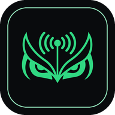
</p>

<h1 align="center">OwlShack</h1>

<p align="center">
  An operator console for <a href="https://github.com/meshcore-dev/MeshCore">MeshCore</a> mesh networks. One static Go binary, no CGO.
</p>

Plug a MeshCore radio into any Linux, macOS or Windows machine (a Raspberry Pi
is plenty), open `http://localhost:8080`, and you get a live console for the
mesh: chat, packet capture, mapping, remote repeater administration, and
telemetry, all persisted to SQLite. Built on the pure Go
[meshcore-go](https://github.com/meshcore-go/meshcore-go) library.

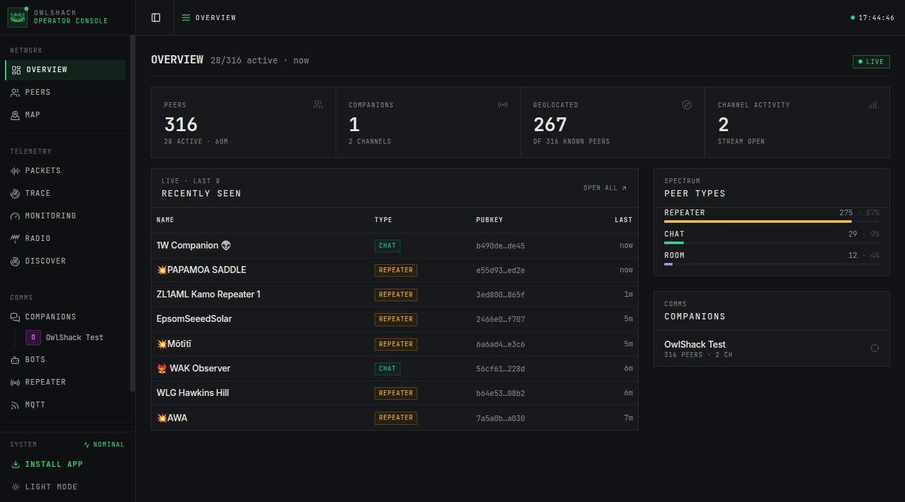

## What it does

- **Runs nodes on the mesh.** One or more companion identities (channels, DMs,
  templated auto-responders) and, optionally, a repeater that relays traffic
  with its own identity, ACL and region scoping.
- **Observes everything.** Every packet, peer and advert is decoded, streamed
  live to the browser, mapped, and archived.
- **Administers remote nodes.** Log in to other operators' repeaters and drive
  them: status, CLI terminal, path, neighbours, settings, access control. Same
  for room servers and sensor nodes.
- **Watches the radio.** Modem fault counters, TX outcomes, RX losses, and a
  zero-hop discovery scan that answers "what can this radio actually hear?".
- **Talks to two radio families.** MeshCore firmware over serial or TCP (KISS),
  or a bare SX1262 driven straight off a Pi's SPI bus, no firmware node needed.
- **Bridges to MQTT.** Feeds aggregators like LetsMesh and CoreScope.

The web UI is the configuration surface and the database is the source of
truth; there is nothing to hand-edit.

## Screenshots

| | |
|---|---|
| 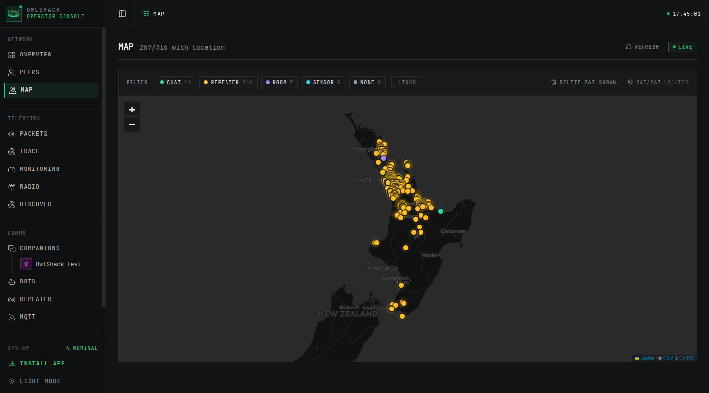 | 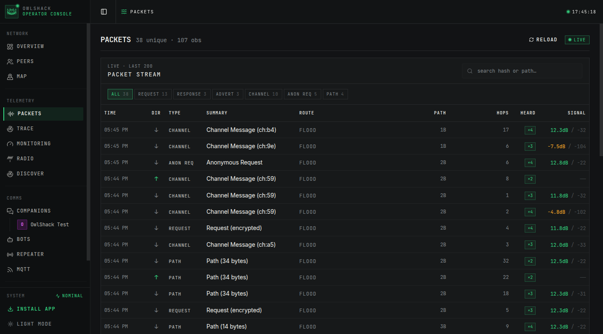 |
| Every geolocated peer, filterable by type, with link lines | Live packet stream, grouped by hash, with route and signal |
| 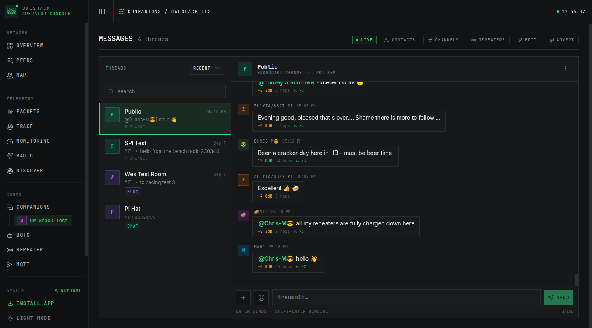 | 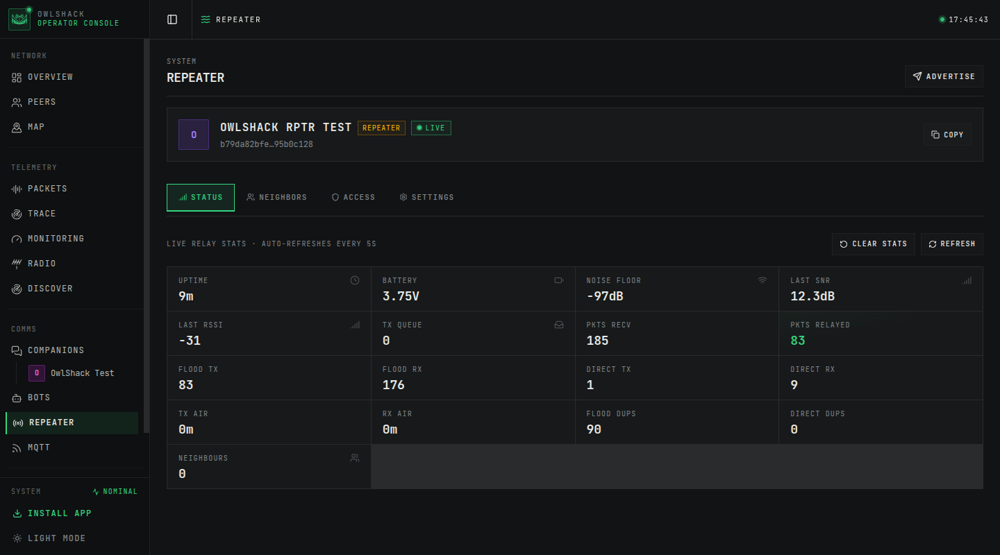 |
| Per-companion chat: channels, DMs, rooms, delivery status | The repeater you run, with live relay stats and ACL |
| 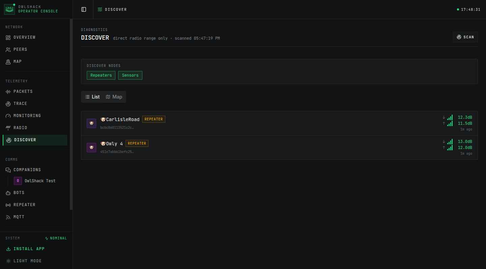 | 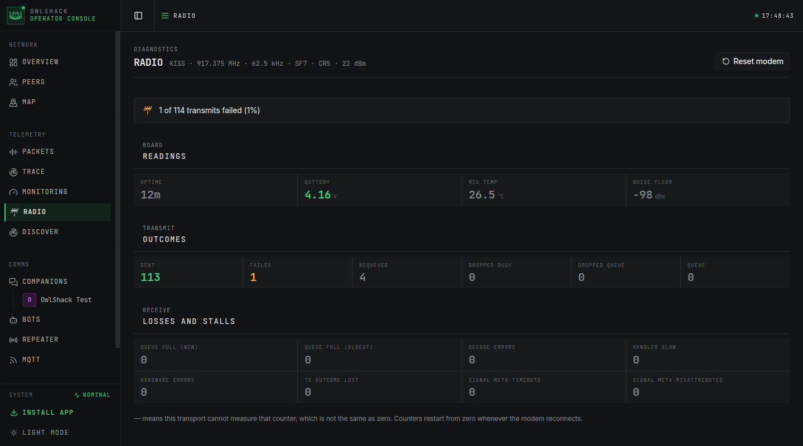 |
| Zero-hop scan: who is in direct range, and both SNR directions | Modem diagnostics, with unmeasurable counters shown as `—` |

Installable as a PWA, with a mobile layout and a light theme.

## The console

| Section | What it does |
|---------|--------------|
| Overview | Peer counts, type spectrum, recently seen, companion roster |
| Peers | Searchable, sortable table with type pills, signal bars, last-seen |
| Map | Leaflet map of geolocated peers, filterable, with link lines |
| Packets | Live packet stream with a detail panel (route, hops, signal, raw hex) |
| Trace | Interactive path builder and result timeline |
| Monitoring | Polled nodes with status and telemetry history charts |
| Radio | Modem diagnostics: TX outcomes, RX losses, board readings, faults |
| Discover | Zero-hop scan: which repeaters and sensors are in direct range |
| Companions | Per-companion chat, contacts, channels, remote repeaters, rooms, sensors |
| Bots | Create and edit triggers across every companion (group and cron) |
| Repeater | The repeater this instance runs: relay stats, neighbours, access, settings |
| MQTT | Broker management and the companion that feeds the bridge |
| Settings | Connection, radio parameters, presets, listen address, log level |

## Supported hardware

### The machine running OwlShack

Any Linux, macOS or Windows host Go targets. Release binaries and Docker images
cover x86-64, 386, ARMv6/v7, ARM64, ppc64le, riscv64 and s390x. A Pi Zero 2 W
is enough to run a companion, a repeater and the console at once.

### Radio interfaces

Set on the Settings page: `serial://` or `tcp://` for a MeshCore firmware node
(KISS), `spi://` plus a board to drive a bare radio yourself.

> [!CAUTION]
> **Which of the two you need.** SPI means this process is the radio driver: it
> clocks an SX126x over the host's own bus and toggles its reset, busy and
> RF-switch lines itself, so the board has to be one it holds a pin map for.
> Everything else (any other chip family, a gateway concentrator, a bridge
> that fakes a bus over USB) belongs on the KISS side, behind MeshCore
> firmware that already knows its own hardware.

| Interface | Status |
|---|---|
| Native SX126x on the host SPI bus | Supported |
| MeshCore firmware over USB serial (KISS) | Supported |
| MeshCore firmware over TCP (KISS) | Supported |
| SX127x on SPI | Not supported |
| SX1302 / SX1303 concentrator boards | Not supported |
| USB-to-SPI bridges (CH341 and similar) | Not supported |
| Boards needing a non-default `gpiochip` | Not supported |

### SPI boards

Pin maps live in [`internal/modem/boards.json`](./internal/modem/boards.json)
and are chosen by board, never by pin. Every entry is an SX1262. Twelve of the
21 can be driven by the current build:

| Board | Max TX | Bus | Status |
|---|---|---|---|
| Zindello UltraPeaterZero (E22, 1 W) | 22 dBm | SPI0.0 | **Verified on hardware** |
| Zindello UltraPeaterZero (E22P, 1 W) | 22 dBm | SPI0.0 | **Verified on hardware** |
| MeshAdv | 22 dBm | SPI0.0 | Preset available, untested |
| Waveshare LoRa HAT | 22 dBm | SPI0.0 | Preset available, untested |
| uConsole LoRa Module aio v2 | 22 dBm | SPI1.0 | Preset available, untested |
| PiMesh-1W (V1) | 18 dBm | SPI0.0 | Preset available, untested |
| PiMesh-1W (V2) | 18 dBm | SPI0.0 | Preset available, untested |
| NebraDuo-E22P-1W | 18 dBm | SPI0.0 | Preset available, untested |
| ZebraHat-1W | 18 dBm | SPI0.0 | Preset available, untested |
| ZebraHatDuo-R0-1W | 18 dBm | SPI0.0 | Preset available, untested |
| ZebraHatDuo-R1-1W | 18 dBm | SPI0.1 | Preset available, untested |
| NebraHat-2W | 8 dBm | SPI0.0 | Preset available, untested |

Max TX is the level the LoRa core is driven at, **not** what leaves the
antenna. Boards with an external PA reach far higher: NebraHat-2W is listed at
8 dBm because that 8 dBm drives its amplifier. Names are the registry's own.

An untested preset is a pin map someone contributed that nobody has since
confirmed against the board in hand. Get one wrong and the radio never
receives, or transmits into a dead antenna path, and both look exactly like a
quiet mesh, so watch the Radio page's counters before you trust a first
contact.

These nine are listed but **cannot be selected**, and the UI says why:

| Board | Why not |
|---|---|
| Zindello UltraPeater (E22) | Needs a non-default `gpiochip` |
| Zindello UltraPeater (E22P, 30 dBm) | Needs a non-default `gpiochip` |
| FemtoFox SX1262 (1W) | Needs a non-default `gpiochip` |
| FemtoFox SX1262 (2W) | Needs a non-default `gpiochip` |
| RAK6421 with RAK1330x, slots 1 and 2 | Needs a non-default `gpiochip` |
| BQ Voyage Station G3 | Needs a non-default `gpiochip` |
| MeshAdv Mini | No confirmed RF-switch control |
| uConsole LoRa Module aio v1 | No confirmed RF-switch control |

### KISS radios

Whatever board MeshCore firmware supports, OwlShack can drive: it speaks to
the firmware, not the chip. Verified here on a Seeed XIAO nRF52840 and a
RAK4631.

### Nodes OwlShack talks to

Any MeshCore repeater, room server or sensor node on the mesh, over the air,
with no wiring and nothing installed on them. Remote administration needs that
node's admin or guest password.

> [!WARNING]
> A first transmit is the moment a wrong pin map costs you hardware. Check the
> antenna is on before anything keys up, and that your frequency and power are
> legal where you are. The shipped defaults are New Zealand's narrow preset,
> 917.375 MHz at 22 dBm, which is not yours to assume. Pick your own region on
> the Settings page or in the wizard.

## Install

### Release binary

Pre-built binaries for Linux, macOS and Windows are on the
[Releases](https://github.com/meshcore-go/OwlShack/releases) page.

```bash
chmod +x OwlShack-linux-arm64
sudo mv OwlShack-linux-arm64 /usr/local/bin/OwlShack
```

### Docker

Published to `ghcr.io/meshcore-go/owlshack` for `linux/386`, `amd64`,
`arm/v6`, `arm/v7`, `arm64/v8`, `ppc64le`, `riscv64` and `s390x`.

```bash
docker run -d \
  --device /dev/ttyACM0 \
  -p 8080:8080 \
  -v "$PWD/data:/data" \
  ghcr.io/meshcore-go/owlshack
```

Drop `--device` for a TCP radio connection.

### From source

Requires Go 1.26+ and Node. The SPA is embedded into the binary, so it has to
be built first:

```bash
git clone https://github.com/meshcore-go/OwlShack.git
cd OwlShack
./build.sh          # builds the SPA, then a version-stamped binary
```

## Quick start

**1. Connect the radio.** USB usually appears as `/dev/ttyACM0` on Linux,
`/dev/cu.usbmodem*` on macOS. On Linux, join the serial group and log back in:

```bash
sudo usermod -a -G dialout $USER
```

**2. Run it.**

```bash
./OwlShack -vvv
```

On a first run OwlShack starts quietly: it observes the mesh and advertises
nothing until you create a companion.

**3. Open `http://localhost:8080`.** A first-run wizard walks through the radio
and your first companion.

| | |
|---|---|
| 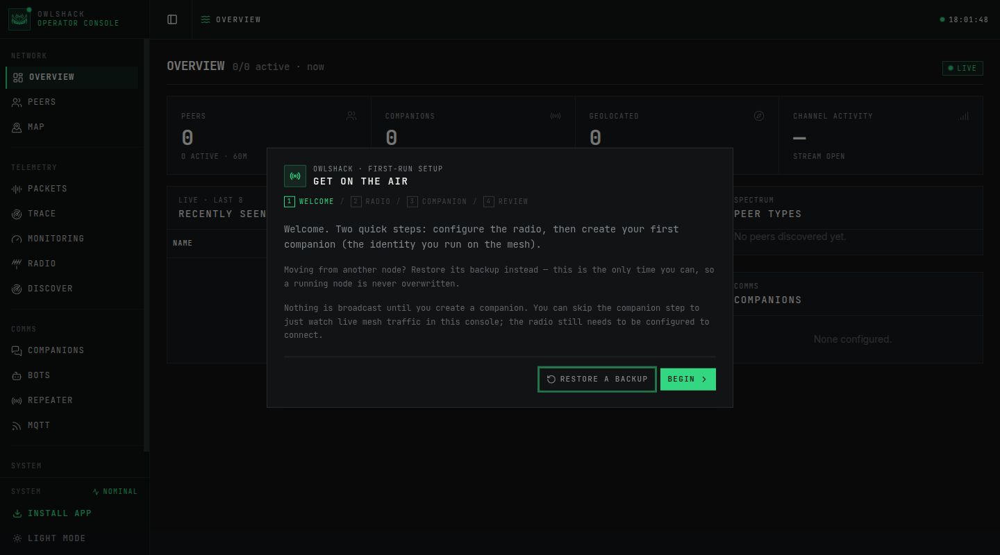 | 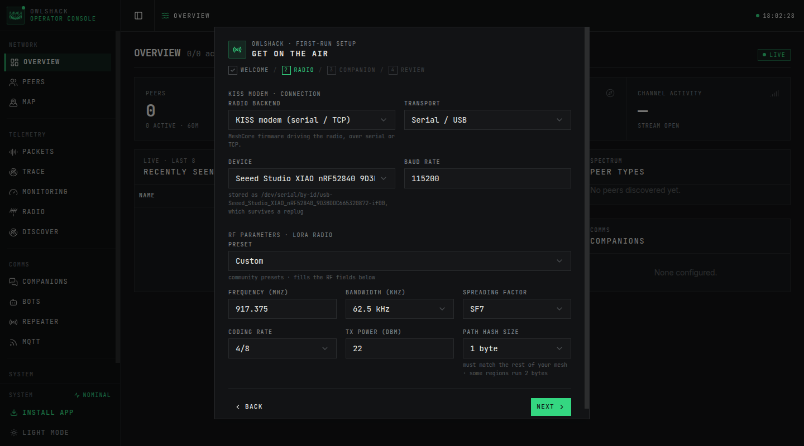 |
| Two steps, and nothing is broadcast until you create a companion | Attached radios are detected by name; presets fill the RF fields |

The review step spells the whole configuration back in plain language before
anything goes on the air:

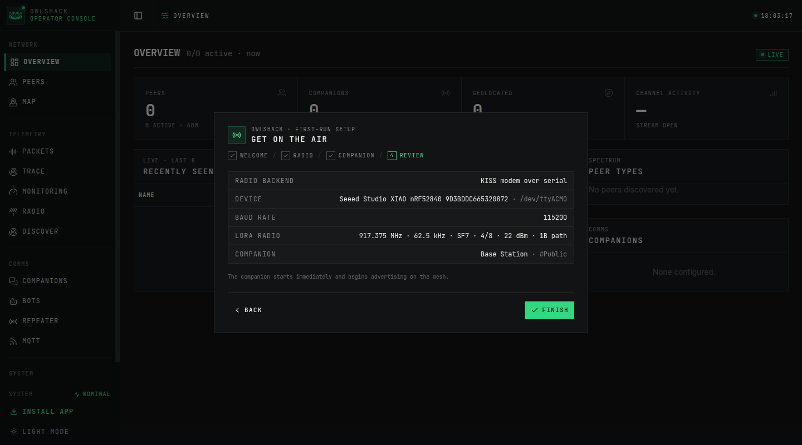

Moving an existing node to new hardware? Restore its backup from the welcome
step. That is the only point at which you can, so a running node is never
overwritten. Everything after setup is configured in the UI and written back to
the database.

## Configuration

Everything is configured in the web UI and stored relationally in
`meshcore.db`. There is no config file to write or maintain: the UI is the
configuration surface, and `SIGHUP` reloads from the database.

> **Migrating from an older release?** `--config <path>` imports a TOML, YAML or
> JSON config file once and overwrites the stored config, after which the file
> is no longer read. Legacy layouts (`nodeType`, `[[bot]]`, `[[observer]]`)
> fold onto the current one automatically. See
> [config-and-storage.md](./docs/config-and-storage.md) for that format.

The rest of this section is a reference for what the settings mean, wherever
you set them.

### Map tiles

The Map, and the position pickers, draw on CARTO basemaps, which now need a
free API key ([carto.com/basemaps/apikey](https://carto.com/basemaps/apikey/),
5M tiles a month). Without one the tiles render watermarked. Paste the key into
Settings; it is stored with your config and visible to anyone who can open the
UI.

### Connection and radio

| Field | Description | Default |
|-------|-------------|---------|
| `connection` | `serial:///dev/ttyACM0`, `tcp://host:port`, or `spi://` | `serial:///dev/ttyACM0` |
| `connectionType` | `kiss` (MeshCore firmware) or `spi` (bare SX1262) | `kiss` |
| `spiBoard` | Board id from the registry, required for `spi://` | none |
| `baudRate` | Serial baud rate | `115200` |
| `freq` | Frequency in MHz | `917.375` |
| `bw` | Bandwidth in kHz | `62.50` |
| `sf` | Spreading factor | `7` |
| `cr` | Coding rate | `8` |
| `tx` | TX power | `22` |
| `logLevel` | `debug`, `info`, `warn`, `error`, `trace` (overridden by `-v`) | `info` |

**SPI radios.** With the connection type set to `spi`, OwlShack drives the
SX1262 itself and `spiBoard` picks the pin map; see
[Supported hardware](#supported-hardware) for which boards that build can
actually drive.

### Companions

A companion is a node identity OwlShack runs on the mesh. Add them on the
Companions page.

| Field | Description |
|-------|-------------|
| `name` | Display name on the mesh, and the storage key for this companion's history |
| `privateKey` | 64-hex ed25519 seed; leave it unset and one is generated and stored |
| `latitude` / `longitude` | Advertised position (decimal degrees) |
| `advertInterval` | Seconds between adverts; `0` = never |
| `channels` | Channels to join |
| `trigger` | Triggers attached to this companion |

### Triggers

Auto-responders and scheduled messages, managed on the Bots page.

| Field | Description |
|-------|-------------|
| `type` | `group` (channel messages) or `cron` |
| `template` | Go `text/template` for the response |
| `channels` | Channels to listen on / send to |
| `match` | [Go regexps](https://pkg.go.dev/regexp/syntax) matched against incoming messages (group) |
| `schedule` | Cron expression, e.g. `"*/5 * * * *"` (cron) |
| `contacts` | Contact names to answer DMs from |
| `retryTimeout` / `maxRetries` | Repeater-echo timeout in seconds (`5`) and resend cap (`3`) |
| `charLimitBehaviour` | `truncate` or `split` past the character limit |
| `pathHashSize` | `0` = copy the sender's setting, `1`/`2`/`3` = bytes per hash |

After sending, a companion waits for a repeater to echo the message back; no
echo inside `retryTimeout` means a resend, up to `maxRetries`.

Channels are public or hashtag channels named directly (`Public`, `#general`),
or private channels carrying a shared key. `Public` is the well-known channel
every companion joins.

### Template variables

Group triggers: `{{.Sender}}` `{{.Channel}}` `{{.Message}}` `{{.Match}}` (named
capture groups) `{{.Timestamp}}` `{{.SNR}}` `{{.RSSI}}` `{{.Hops}}`
`{{.PathHashes}}` `{{.PathHashSize}}`.

Cron triggers: `{{.Time}}` and `{{.Schedule}}`. `{{.BotName}}` is in every
template. `formatPathBytes` renders raw path hashes readably (`Direct` when
there is no path).

## MQTT

OwlShack publishes observed traffic to MQTT brokers, used by
[LetsMesh](https://letsmesh.net) and
[CoreScope](https://github.com/Kpa-clawbot/CoreScope) to aggregate network
data. Brokers are managed on the MQTT page.

| Bridge field | Description |
|--------------|-------------|
| `node` | Companion that feeds the bridge, exactly one (empty = the first) |
| `enabled` | Whether the bridge runs |
| `iataCode` | Location identifier, e.g. an airport code |
| `statusInterval` | Seconds between status publishes (default `300`) |
| `owner` / `email` | Optional, included in MQTT token claims |

| Broker field | Description |
|--------------|-------------|
| `name` / `enabled` | Display name; whether this broker is used |
| `transport` | `websockets` or `tcp` |
| `host` / `port` / `path` | Endpoint; `path` is the WebSocket path (default `/`) |
| `packetTopic` / `statusTopic` | Templates; `{iata}` `{pubkey}` `{name}` (uppercase also resolves). Empty = `meshcore/{iata}/{pubkey}/<kind>` |
| `disallowedPacketTypes` | Types to exclude, e.g. `["ack", "advert"]` |
| `dedup` / `retainStatus` | Per-broker packet dedup; retain status messages |
| `tlsEnabled` / `tlsInsecure` | Enable TLS / skip certificate verification |
| `authType` | `token` (Ed25519 JWT from the node identity), `basic`, or `none` |
| `username` / `password` / `audience` | Basic credentials; token audience |

For LetsMesh, that is `mqtt-us-v1.letsmesh.net:443` over websockets with TLS
and `token` auth, the audience matching the host.

Only RX packets are published, never TX. See
[docs/mqtt-and-radio.md](./docs/mqtt-and-radio.md) for the wire schema.

## Running it

| Flag | Description |
|------|-------------|
| `-c, --config PATH` | One-time import of a legacy config file, then run with it |
| `-V, --version` | Print version and exit |
| `-v, --verbose` | Increase log verbosity (`-v` debug, `-vv` trace, `-vvv` trace+) |

`HOST` and `PORT` override the stored listen address at startup (env > stored
config > `:8080`), which is handy for Docker and PaaS: `PORT=4432 ./OwlShack`.

`SIGHUP` reloads config from the database without a restart. Reloads are
diff-based: only companions whose config actually changed are restarted, so
the rest keep their sessions. A radio change reconnects the modem; changing the
listen address needs a process restart.

```bash
kill -SIGHUP $(pgrep OwlShack)
```

## Security

There is **no authentication** on the REST API or the UI. Anyone who can reach
the port can reconfigure your radio, post as your companions, and drive any
repeater you have logged into. Bind it to localhost, or put it behind a reverse
proxy that authenticates.

## Docs

| Doc | Covers |
|---|---|
| [firmware-protocol.md](./docs/firmware-protocol.md) | The wire: CLI replies, request types, path routing, DM/room plaintexts, sensors |
| [config-and-storage.md](./docs/config-and-storage.md) | Config tables, `/api/config/*`, backup/restore, REST endpoints |
| [frontend.md](./docs/frontend.md) | Styling system, page patterns, mobile, PWA |
| [mqtt-and-radio.md](./docs/mqtt-and-radio.md) | MQTT wire schema, duty cycle, path hash size |
| [CHANGELOG.md](./CHANGELOG.md) | Release history |

## Licence

See [LICENSE](LICENSE).
